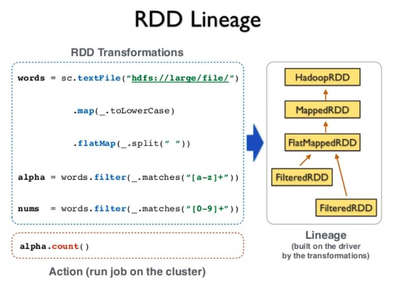

# Resilient Distributed Datasets (RDDs) - Lab

## Introduction

Resilient Distributed Datasets (RDD) are fundamental data structures of Spark. An RDD is, essentially, the Spark representation of a set of data, spread across multiple machines, with APIs to let you act on it. An RDD could come from any datasource, e.g. text files, a database, a JSON file etc.

> RDDs Spark specific structures that let users explicitly __persist__ intermediate results in memory, control their __partitioning__ to optimize data placement, and manipulate them using a rich set of operators.

This is quite a handful. In this lesson, we will try to demistify RDDs with some hands on pratice. 

*__Note:__ Your are advised to visit all the included external links to see more examples of stated concepts.* 

## Objectives

You will be able to:

* Describe RDDs as fundamental storage units in Spark computing environment
* Create RDDs from Python collections
* Set number of partitions for parallelizing RDDs
* Review an RDD's dependancy graph at different stages of processing. 

## What Are RDDs ?

Resilient Distributed Datasets (RDDs) are the core concept in Spark. RDDs can be thought of as __immutable distributed collections of data objects__. Each dataset in RDD is divided into logical partitions, which may be computed on different nodes of the cluster. In order to understand how spark works, we should know what RDD’s are and how they work.


__The Spark RDD is a fault tolerant, distributed collection of data that can be operated in parallel__. With the RDD split into partitions as shown above, spark runs one task for each partition. The Spark RDDs can contain any type of Python, Java or Scala objects, including user-defined classes. 

>RDDs are not actual data, but they are Objects, which contains information about data residing on the cluster. 

RDDs try to solve computational problems by enabling fault tolerant, distributed In-memory computations. RDDs have the following properties –

__Immutability and partitioning__: RDDs composed of collection of records which are partitioned. Partition is basic unit of parallelism in a RDD, and each partition is one logical division of data which is immutable and created through some transformations on existing partitions.Immutability helps to achieve consistency in computations.Users can define their own criteria for partitioning based on keys on which they want to join multiple datasets if needed.

__Coarse grained operations__: Coarse grained operations are operations which are applied to all elements in datasets. For example – a map, or filter or groupBy operation which will be performed on all elements in a partition of RDD.

__Fault Tolerance__: Since RDDs are created over a set of transformations , it logs those transformations, rather than actual data.Graph of these transformations to produce one RDD is called as Lineage Graph.

__Resiliance__: RDDs load the data for us and are resilient, which means they can be recomputed when needed.

__Lazy evaluated__: The data inside RDD is not available or transformed until an action is executed that triggers the execution.

### RDD Transformations vs Actions

In Spark, we first create a __base RDD__ and then apply one or more transformations to that base RDD following our processing needs. Being immutable means, **once an RDD is created, it cannot be changed**. As a result, **each transformation on an RDD creates a new RDD**. Finally, we can apply one or more **actions** to the RDDs. Spark uses lazy evaluation, so transformations are not actually executed until an action occurs. 

>*RDDs perform two types of operations: Transformations, which creates a new dataset from the previous RDD and Actions, which return a value to the driver program after performing the computation on the dataset.*


Let's see this behaviour through a simple example. In this example, we shall perform several actions and transformations on RDDs in order to obrain a better understanding of Spark processing. 

### Create a Python collection 

We need some data to start experimenting with RDDs. Let's create some sample data and see how RDDs handle it. 

- Create a Python list `data` of integers between 1 and 1000. 
- Use the `range()` function to create this list of a length = 1000 (1 - 1000 inclusive). 
- Sanity check : confirm the length of the list 


```python
# Create a list (data) as data = [1,2,3..,1000]

# Code here 


```

    1 1000
    1000


### Create RDD from Python collections

In the spark computation model, datasets are treated as list of entries. Such lists are split into a number of different logical partitions that may be stored on different cores on the same computer or across the cluster. Each split partition holds a unique subset of original data. RDDs and are used to split, transform and combine the data during processing. 

Unlike Hadoop which uses physical disks to process data and store intermediate results, __Spark performs in-memory processing__ which allows high speed processing, that can be performed at a much lower computational cost. Following figure shows an overview of Spark processing model. For a list like the one we created above, all entries are distributed over different workers as shown:


RDDs can be created in two different ways:

1. __Referencing__ an external data set in an external storage system, such as a shared file system, HDFS, HBase, or any data source offering a Hadoop Input Format.

2. __Parallelizing__ a collection of objects (a list or a set) in the driver program.

[Visit the documentation](https://spark.apache.org/docs/2.1.1/programming-guide.html) to read more on these methods. For this lab, we shall use the second approach with the collection we created earlier. 

### `SparkContext.parallelize()` for creating RDDs

In order to create RDDs in Spark, we will use `sc.parallelize()` method. This tells spark to create a new RDD based on the data that is passed in. A second argument tells Spark to set a number of paritions for this data as highlighted in the figure above. The elements of the collection are copied to form a distributed data set that can be operated on in parallel.

__Refer to the documentation and use this method to create an RDD (call it `intRDD`) with 5 partitions for the list of integers in `data`, calculated earlier. Remember to intialize a SparkContext first.__ 


```python
# Import spark and initiate a local SparkContext (execute only once)

# Code here 

```


```python
# Create an RDD with list created earlier, splitting it into 5 partitions

# Code here 
```

Remember due to lazy evaluation used by Spark, no Spark computation (a.k.a a Spark job) is performed at this state. We can see more options for creating new RDDs by studying built in help on `sc.parallelize()`.


```python
# Get help on sc.parallelize() method


# Code here 


```

    Help on method parallelize in module pyspark.context:
    
    parallelize(c, numSlices=None) method of pyspark.context.SparkContext instance
        Distribute a local Python collection to form an RDD. Using xrange
        is recommended if the input represents a range for performance.
        
        >>> sc.parallelize([0, 2, 3, 4, 6], 5).glom().collect()
        [[0], [2], [3], [4], [6]]
        >>> sc.parallelize(xrange(0, 6, 2), 5).glom().collect()
        [[], [0], [], [2], [4]]
    


Note: `glom()` method allows treating a partition as a multidimensional array rather as single row at time allowing to speed up some operations with some increased memory usage. More information on `glom()` can be found [here](http://blog.madhukaraphatak.com/glom-in-spark/). We shall also see how `collect()` action works later in this lab. 

### Types of RDDs

There are many different types of RDDs in Spark. The base class for RDDs is `pyspark.RDD`. Since the other RDD types inherit from pyspark.RDD they have the same APIs and are functionally identical. [Visit this document](https://jaceklaskowski.gitbooks.io/mastering-apache-spark/spark-rdd.html) to see a list of Common RDD types.


Initializing `sc.parallelize()` with a list generates a `pyspark.rdd.PipelinedRDD`. Let's check the type of our RDD to confirm this.   


```python
# Check the type of RDD created earlier, i.e. intRDD

# Code here 


```


    pyspark.rdd.PipelinedRDD


### RDD `id` and `setName()`
Each RDD created this way has a unique ID which is used by the Spark system to refer to the RDD. this can be viewed by using `RDD.id()` function. Let's check the id of RDD we have just created. 

*Note that this value may be different depending upon the sequence of RDD creation and code execution.*


```python
# Each RDD gets a unique ID

# Code here 

# intRDD id: 3
```

    intRDD id: 1


Spark also allows naming of RDDs after they've been created using the `setname()` method. Let's use this method to set the name of our RDD as "My First RDD""


```python
# We can name each newly created RDD using the setName() method

# Code here 

# My first RDD PythonRDD[3] at RDD at PythonRDD.scala:49
```


    My first RDD PythonRDD[1] at RDD at PythonRDD.scala:53


### RDD Lineage
RDD Lineage (aka RDD operator graph or RDD dependency graph) is a graph of all the parent RDDs of a RDD. It is built as a result of applying transformations to the RDD and creates a logical execution plan. 




We can view the lineage (set of transformations) using the `RDD.toDebugString()` method. 

Let's check the lineage of our RDD using this method. 


```python
# Get RDD Dependancy Graph


# Code here 


# b'(4) PythonRDD[2] at RDD at PythonRDD.scala:49 []\n |  
# ParallelCollectionRDD[1] at parallelize at PythonRDD.scala:184 []'
```


    b'(4) PythonRDD[2] at RDD at PythonRDD.scala:49 []\n |  ParallelCollectionRDD[1] at parallelize at PythonRDD.scala:184 []'


You are encouraged to call this property at different stages of data processing to view the dependancy between RDDs. We will see this in effect in our upcoming labs with transformations. 

In order to check the methods and transformations that can be applied to RDDs, we can simply use the `help()` function.


```python
# Code here 
```

We shall cover some of these methods and transformations in upcoming lessons and labs. As a quick example, Let's look at the `getNumPartitions()` function which resuts the total partitions of an RDD.

    getNumPartitions(self)
           Returns the number of partitions in RDD

__Get number of partitions of the `intRDD`__


```python
# Get number of partitions

# Code here 
```


    5


## Types of RDD operations

Earlier we mentioned that RDD operations can be distonguished as Actions of Transformations. Let's quickly look what these entail.

### Transformations

Transformations create a new data set from an existing one by passing each dataset element through a function and returns a new RDD representing the results. In short, creating an RDD from an existing RDD is ‘transformation’.
All transformations in Spark are lazy. They do not compute their results right away. Instead, they just remember the transformations applied to some base data set (e.g. a file). The transformations are only computed when an action requires a result that needs to be returned to the driver program.
A transformationon a RDD that returns another RDD, like map, flatMap, filter, reduceByKey, join, cogroup, etc.

### Actions
Actions return final results of RDD computations. Actions trigger execution using lineage graph to load the data into original RDD and carry out all intermediate transformations and return the final results to the Driver program or writes it ou
t to the file system. An action returns a value (to a Spark driver - the user program).

Here are some of key transformations and actions that we will explore later.

          

In the following labs. we shall practice the key transformations and actions in order to split, process and analyze datasetes as RDDs. 

## Additional Reading 

- [RDDs in Apache Spark](https://data-flair.training/blogs/create-rdds-in-apache-spark/)
- [Programming with RDDs](https://runawayhorse001.github.io/LearningApacheSpark/rdd.html)

## Summary

In this lesson we went through a brief introduction to RDD creation from a Python collection, setting number of logical partitions for an RDD and extracting lineage and of an RDD in a spark application. We also looked at checking an RDD's id used by spark and setting names for RDDs as an indication of content. Following labs will build upon this knowledge and we shall see how transformations and actions can be applied to RDDs in a distributed setup. 

